# Détection de Fraudes en Temps Réel avec Kafka Streams, InfluxDB et Grafana

Ce projet propose une solution pour détecter les transactions financières suspectes en temps réel en utilisant **Kafka Streams**, **InfluxDB**, et **Grafana**. La solution est conteneurisée avec Docker pour faciliter le déploiement.

## Fonctionnalités

1. **Traitement des transactions en temps réel** :
   - Lecture des transactions depuis le topic `transactions-input` (format JSON).
   - Détection des transactions suspectes basées sur une règle simple : montant > 10 000.
   - Publication des transactions suspectes dans le topic `fraud-alerts`.

2. **Stockage des transactions suspectes** :
   - Utilisation de **InfluxDB** pour enregistrer les transactions détectées comme suspectes.

3. **Visualisation des anomalies** :
   - Création d'un tableau de bord interactif avec **Grafana** pour afficher :
      - Le nombre de transactions suspectes par utilisateur.
      - Le montant total des transactions suspectes sur une période donnée.

4. **Déploiement complet avec Docker** :
   - Configuration centralisée via un fichier `docker-compose.yml`.

## Architecture

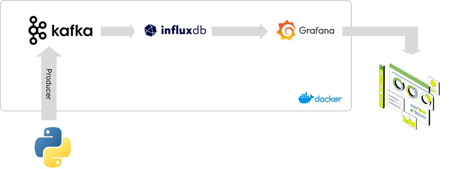

L'architecture inclut :
- Un producteur Kafka générant des transactions JSON.
- Kafka Streams pour le traitement en temps réel.
- InfluxDB pour le stockage des données suspectes.
- Grafana pour la visualisation.

## Configuration et Déploiement

### Prérequis
- Docker et Docker Compose installés.
- Accès à une instance Grafana.

### Étapes
1. Clonez ce dépôt :
   ```bash
   git clone https://github.com/username/kafka-fraud-detection.git
   cd kafka-fraud-detection
   ```

2. Lancez les services avec Docker Compose :
   ```bash
   docker-compose up -d
   ```

3. Configurez Grafana pour se connecter à InfluxDB :
   - Ajoutez une nouvelle source de données avec les paramètres suivants :
      - URL : `http://influxdb:8086`
      - Bucket : `fraud-detection-bucket`
      - Organisation : `fraud-detection-org`

4. Importez le tableau de bord Grafana depuis le fichier `grafana-dashboard.json`.

## Exemple de Transaction JSON

Voici un exemple de transaction financière consommée depuis `transactions-input` :
```json
{
  "userId": "12345",
  "amount": 15000,
  "timestamp": "2024-12-04T15:00:00Z"
}
```

## Règles de Détection

Les transactions sont considérées comme suspectes si :
- Le montant (`amount`) est supérieur à 10 000.

Les transactions suspectes sont publiées dans le topic `fraud-alerts` et sauvegardées dans InfluxDB.

## Test et Validation

1. Utilisez le script Python fourni (`producer.py`) pour générer des transactions test :
   ```bash
   python producer.py
   ```

2. Vérifiez que les transactions suspectes sont présentes dans le topic `fraud-alerts` :
   ```bash
   kafka-console-consumer.sh --topic fraud-alerts --bootstrap-server localhost:9092
   ```

3. Ouvrez Grafana pour visualiser les transactions suspectes en temps réel.

## Structure du Répertoire

- `src/` : Code source de l'application Kafka Streams.
- `docker-compose.yml` : Fichier pour déployer Kafka, InfluxDB et Grafana.
- `producer.py` : Script pour générer des transactions.
- `grafana-dashboard.json` : Configuration du tableau de bord Grafana.

## Schéma de l'Architecture

1. Producteur Kafka : Envoie des transactions JSON.
2. Kafka Streams : Filtre les transactions suspectes.
3. InfluxDB : Stocke les transactions détectées.
4. Grafana : Visualise les transactions suspectes.

## Contributions

Les contributions sont les bienvenues ! Veuillez ouvrir une *issue* ou soumettre une *pull request*.

## Resultat de visualisation

[20241216-2109-13.4042024.mp4](..%2F..%2F..%2F..%2F..%2FAppData%2FLocal%2FPackages%2FMicrosoft.ScreenSketch_8wekyb3d8bbwe%2FTempState%2FRecordings%2F20241216-2109-13.4042024.mp4)

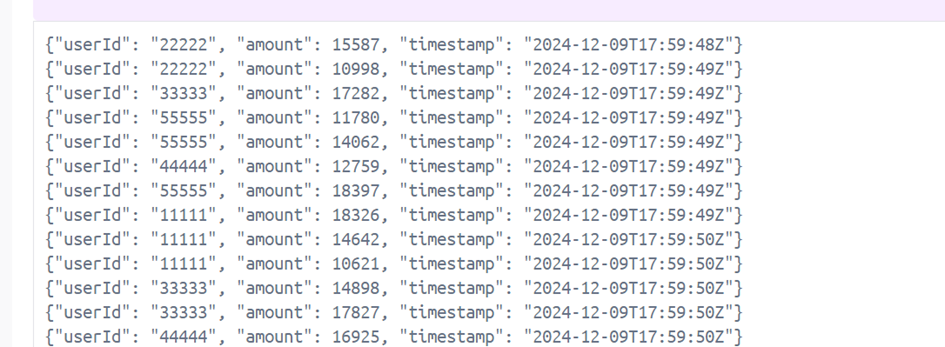
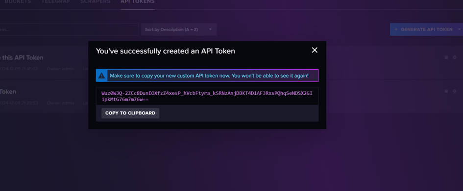
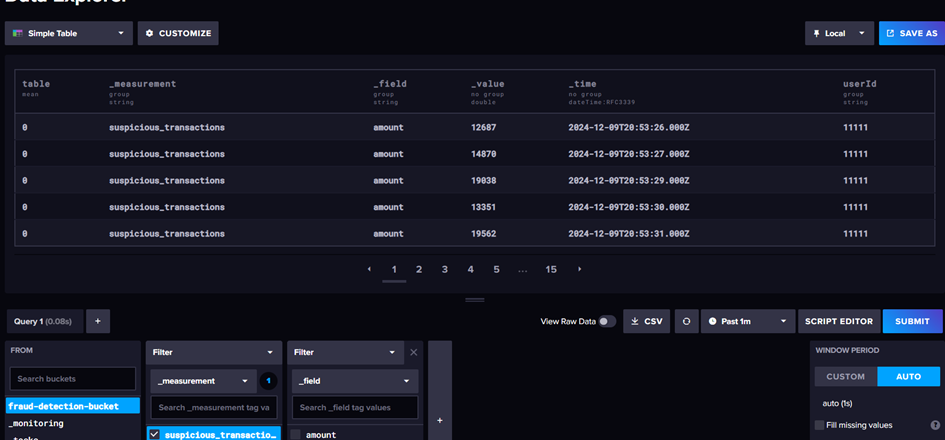
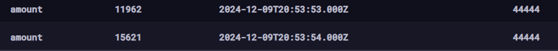
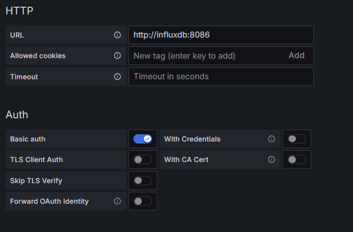
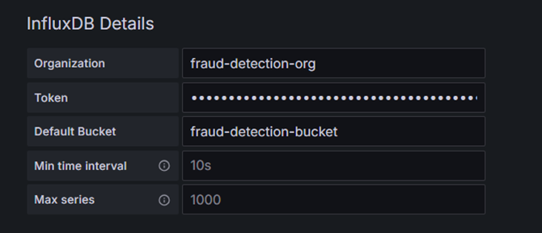
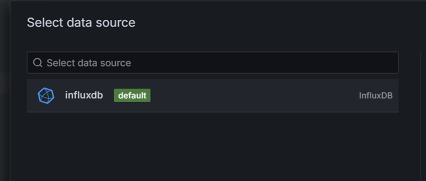
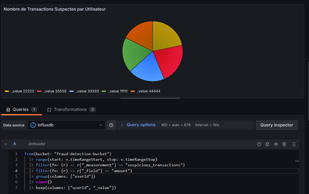
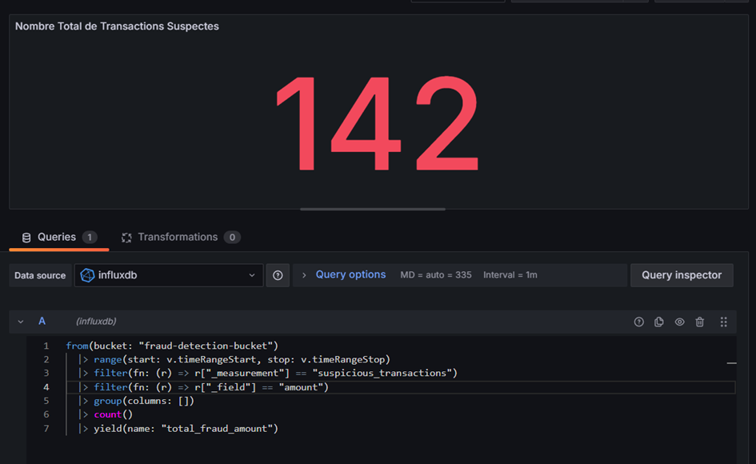
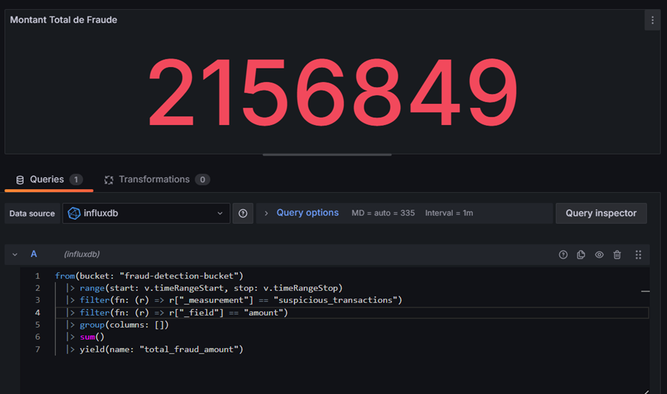
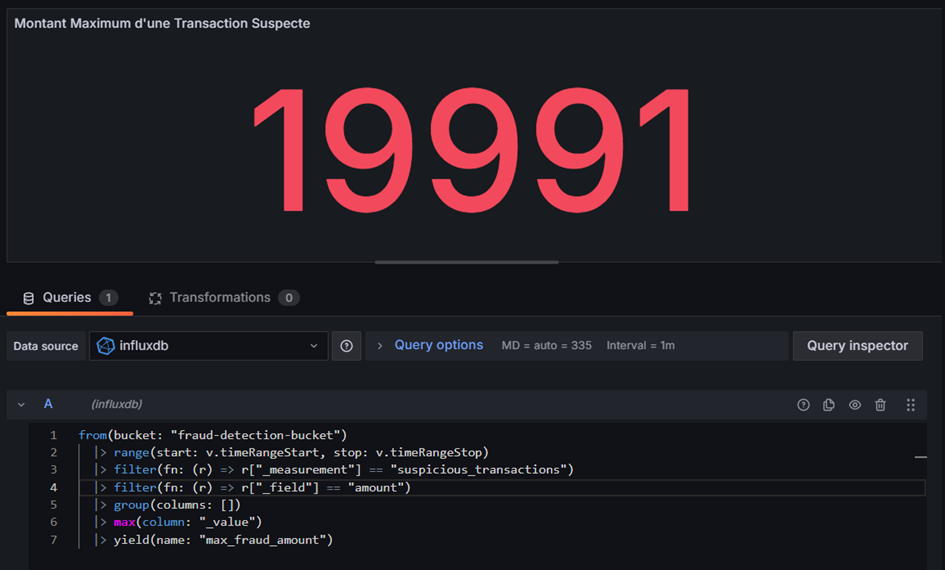
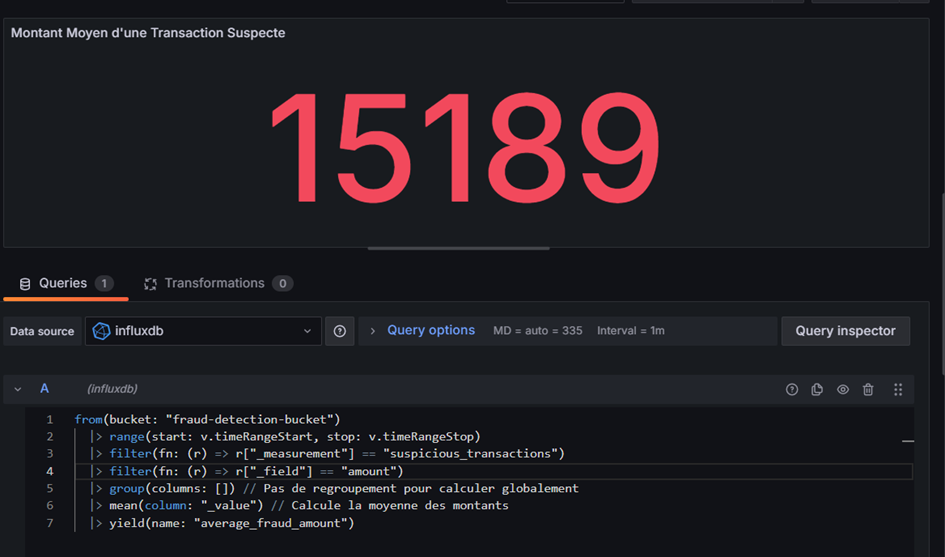


